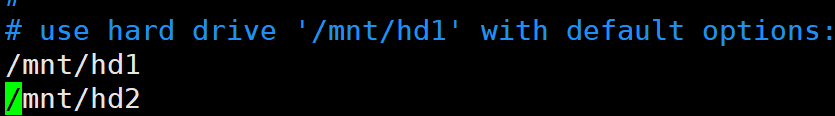
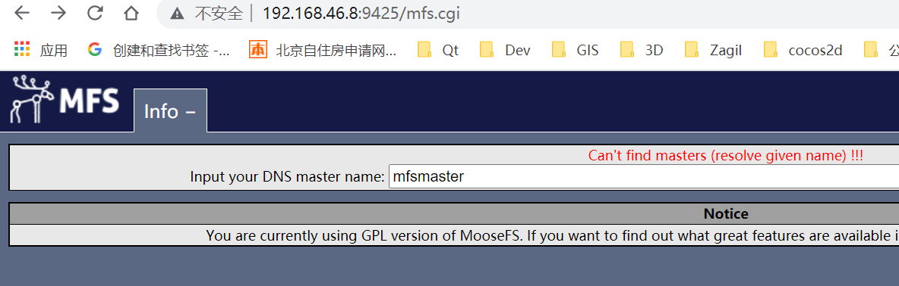
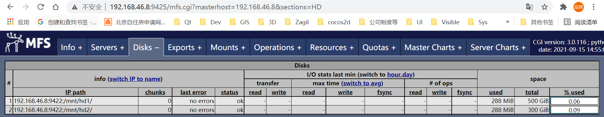
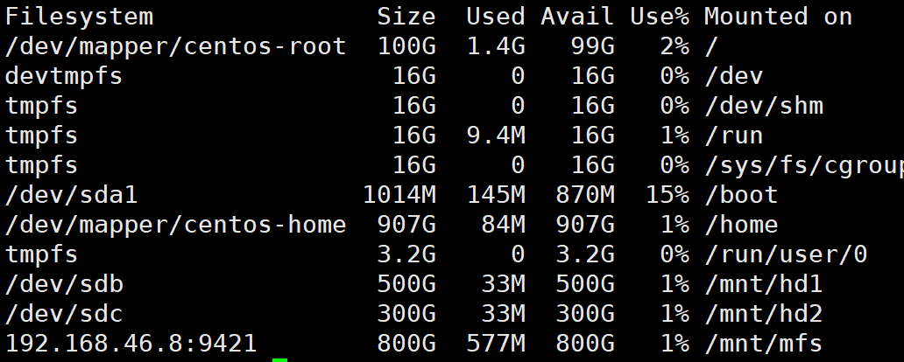

# moosefs编译安装（mfs）
实验说明：
- 实验环境采用centos7.6虚拟机，16core，32GB内存，一块系统盘，两块附加盘；
- master，log，chunkserver等均在一台机器启动；
- 
## 一、源码下载及编译
https://github.com/moosefs/moosefs/releases
本验证环境采用3.0.116版本
```
wget https://github.com/moosefs/moosefs/archive/refs/tags/v3.0.116.tar.gz
```

### 1.1 依赖环境安装
```
yum install wget;
wet 
yum install gcc;
yum install gcc-c+;
yum install openssl-devel;(不确定是否需要)
yum install fuse-devel;(编译mfsmount需要)
```

### 1.2 系统准备
1. 初始化mfs需要的盘，默认的盘创建后，可以再fdisk -l中看到，但是df -h看不到，需要对盘进行格式化
- 通过lsblk查找需要格式化的硬盘，未格式化的硬盘没有UUID，如sdb，sdc
```
[root@bogon soft]# lsblk -f
NAME            FSTYPE      LABEL UUID                                   MOUNTPOINT
sda                                                                      
├─sda1          xfs               3e7960d0-3e27-4d22-9d26-dcb15fd17cdd   /boot
└─sda2          LVM2_member       kQzSHp-1kUy-XUFx-cUli-39SY-D01u-ybAqb0 
  ├─centos-root xfs               0b878c82-1937-41e3-8ebd-6258cbaed394   /
  ├─centos-swap swap              09b7a442-ea79-4b5c-9df6-8d2c6ee46322   [SWAP]
  └─centos-home xfs               e1857c42-45ae-4c4f-beef-19fbbe2b113e   /home
sdb                                                                      
sdc                                                                     
   
```
- 硬盘格式化
```
mkfs.xfs  /dev/sdb -f
```
- 格式化后，可以看到uui
```
[root@bogon soft]# lsblk -f
NAME            FSTYPE      LABEL UUID                                   MOUNTPOINT
sda                                                                      
├─sda1          xfs               3e7960d0-3e27-4d22-9d26-dcb15fd17cdd   /boot
└─sda2          LVM2_member       kQzSHp-1kUy-XUFx-cUli-39SY-D01u-ybAqb0 
  ├─centos-root xfs               0b878c82-1937-41e3-8ebd-6258cbaed394   /
  ├─centos-swap swap              09b7a442-ea79-4b5c-9df6-8d2c6ee46322   [SWAP]
  └─centos-home xfs               e1857c42-45ae-4c4f-beef-19fbbe2b113e   /home
sdb             xfs               25856cc8-250c-45c8-9169-90ba1215149e   
sdc             xfs               6479c685-ac17-4c59-8e61-2b3c0122acf8  
```
2. 硬盘挂载
``` shell
mkdir /mnt/hd1
mkdir /mnt/hd2
-- 编辑/etc/fstab，添加挂载盘
UUID=25856cc8-250c-45c8-9169-90ba1215149e  /mnt/hd1 xfs defaults 0 0
UUID=6479c685-ac17-4c59-8e61-2b3c0122acf8  /mnt/hd2 xfs defaults 0 0
```

3. 创建mfs用户，以及修改/mnt/hd1和hd2权限
```
groupadd mfs
useradd -g mfs mfs
chown -R mfs:mfs /mnt/hd1
chown -R mfs:mfs /mnt/hd2
```


### 1.3 编译
1. 编译配置
```
./configure --enable-mfsmount
make -j 6
make install
```
2. 编译完成后，主要目录如下：
- 在/usr/local/sbin目录下有mfs主要的运行程序，包括mfsmaster、mfsmetalogger，mfschunkserver等；
- 在/usr/local/bin下有mfsmount等；
- 

## 二、启动运行
主要启动mfsmaster，mfschunkserver，mfsmetalogger；
### 2.1 mfsmaster启动
1. 如果是分布式启动，需要在每个节点上为 mfsmaster 所在节点（192.168.46.8）增加一个别名 mfsmaster（在96-99上分别执行如下命令） 
echo "192.168.46.8 mfsmaster " >> /etc/hosts

2. 执行启动命令，默认会报错，找不到cfg文件
```
[root@bogon bin]# /usr/local/sbin/mfsmaster start
cannot load config file: /usr/local/etc/mfs/mfsmaster.cfg
can't load config file: /usr/local/etc/mfs/mfsmaster.cfg - using defaults
open files limit has been set to: 16384
working directory: /usr/local/var/mfs
lockfile created and locked
initializing mfsmaster modules ...
mfsexports configuration file (/usr/local/etc/mfs/mfsexports.cfg) not found - please create one (you can copy /usr/local/etc/mfs/mfsexports.cfg.sample to get a base configuration)
no exports defined !!!
init: exports manager failed !!!
error occurred during initialization - exiting
```
3. 进入/usr/local/etc/mfs/，可以看到cfg的sample文件，赋值一个，将sample后缀去掉
```
[root@bogon mfs]# cp mfsmaster.cfg.sample mfsmaster.cfg
[root@bogon mfs]# cp mfshdd.cfg.sample mfshdd.cfg
[root@bogon mfs]# cp mfschunkserver.cfg.sample mfschunkserver.cfg
[root@bogon mfs]# cp mfsmetalogger.cfg.sample mfsmetalogger.cfg
[root@bogon mfs]# cp mfstopology.cfg.sample mfstopology.cfg
[root@bogon mfs]# cp mfsexports.cfg.sample mfsexports.cfg
```
4. 再次运行mfsmaster start，会报错，是编译时未指定mfs用户指定的，需要编辑mfsmaster.cfg指定用户
```
[root@bogon mfs]# /usr/local/sbin/mfsmaster start
open files limit has been set to: 16384
working directory: /usr/local/var/mfs
lockfile created and locked
initializing mfsmaster modules ...
exports file has been loaded
topology file has been loaded
loading metadata ...
can't find metadata.mfs - try using option '-a'
init: metadata manager failed !!!
error occurred during initialization - exiting
```
5. 打开mfsmaster.cfg，将WORKING_USER = nobody修改为WORKING_USER = mfs，同时将mfschunkserver.cfg和mfsmetalogger.cfg进行修改
6. 继续运行mfsmaster，会出现如下错误，
can't create lockfile in working directory: EACCES (Permission denied)
需修改目录权限
```
 chown -R mfs:mfs /usr/local/var/mfs
```
7. 继续运行mfsmaster，会出现如下错误，
```
open files limit has been set to: 16384
working directory: /usr/local/var/mfs
lockfile created and locked
initializing mfsmaster modules ...
exports file has been loaded
topology file has been loaded
loading metadata ...
can't find metadata.mfs - try using option '-a'
init: metadata manager failed !!!
error occurred during initialization - exiting
```
8. 从编译目录下，找到moosefs-3.0.116/mfsdata/metadata.mfs，拷贝到 /usr/local/var/mfs
```
cp /home/soft/moosefs-3.0.116/mfsdata/metadata.mfs /usr/local/var/mfs/
```
9. 重新运行，/usr/local/sbin/mfsmaster start，显示启动成功
```
[root@bogon mfs]# /usr/local/sbin/mfsmaster start
open files limit has been set to: 16384
working directory: /usr/local/var/mfs
lockfile created and locked
initializing mfsmaster modules ...
exports file has been loaded
topology file has been loaded
loading metadata ...
metadata file has been loaded
no charts data file - initializing empty charts
master <-> metaloggers module: listen on *:9419
master <-> chunkservers module: listen on *:9420
main master server module: listen on *:9421
mfsmaster daemon initialized properly
```

### 2.2 mfschunkserver
1. chunkserver主要涉及到挂载盘，启动前先修改mfshdd.cfg文件，添加挂载盘


2. 修改mfschunkserver.cfg文件，将MASTER_HOST注释打开，并设置masterip，如：MASTER_HOST = 192.168.46.8
3. 启动mfschunksever
```
[root@bogon mfs]# /usr/local/sbin/mfschunkserver start
open files limit has been set to: 16384
working directory: /usr/local/var/mfs
lockfile created and locked
setting glibc malloc arena max to 4
setting glibc malloc arena test to 4
initializing mfschunkserver modules ...
hdd space manager: path to scan: /mnt/hd2/
hdd space manager: path to scan: /mnt/hd1/
hdd space manager: start background hdd scanning (searching for available chunks)
main server module: listen on *:9422
no charts data file - initializing empty charts
mfschunkserver daemon initialized properly
```

### 2.3 mfsmetalogger
启动前，参考mfschunkserver，需要将cfg中的MASTER_HOST进行修改
/usr/local/sbin/mfsmetalogger start

### 2.4 mfscgiserv
启动监控界面
``` python /usr/local/bin/mfscgiserv ```
默认防火墙可能开启，需先关闭防火墙
```  systemctl stop firewalld  ```
前端打开网页

网页未显示内容是mfsmaster未配置导致，可以手动输入mfsmaster的ip地址，即可


## 三、mfsmount挂载
临时挂载可采用
mfsmount /mnt/mfs/ -H 192.168.46.8
df -h可以看到挂载盘


## 四、编译安装中遇到的问题及解决方法
1. mfsmount未编译
进行编译配置时，enable mfsmount，默认配置不会编译mfsmount，mfsmount编译需要依赖fuse
```
./configure --enable-mfsmount
```
2. chunkserver can't create lockfile in working directory:EACCES
未设置mfsmaster.cfg或者mfschunkserver文件的WORKING_USER=mfs，默认指向nobody
如果已经启动过，需要同时修改mfs管理目录的用户权限
chown -R mfs:mfs /usr/local/var/mfs

## 有待进一步完善
- 配置开机启动；
- 安装目录修改，默认在/usr/local/sbin及/usr/local/bin
- 配置目录修改，默认在/usr/local/etc/mfs/..
- 配置mfs管理目录，默认在/usr/local/var/mfs/..
- 永久挂载


## 参考：
1. https://www.cnblogs.com/liaojiafa/p/6062836.html
2. https://www.cnblogs.com/rockbes/p/3989410.html