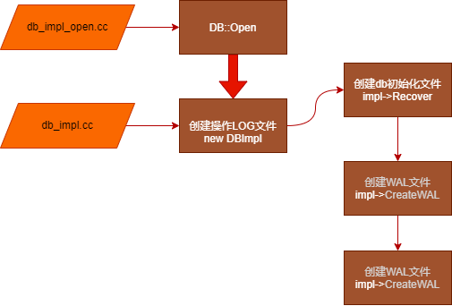

# RocksDB源码分析之一：DB::Open流程及源码分析
> 本系列文章，基于RocksDB 6.22.1
- 分析rocksdb 打开，关闭流程中，都做了什么，有哪些相关类及技术点；
- 解读过程会从场景示例出发，从现象到源码逐层解读；
- 本篇文章从总体上进行阐述，对相关概念进行初步解释和整体流程理解，后续文章会分别就Options，MANIFEST、ColumnFamily等关键概念进行单独解读。

---
## 现象分析：测试代码及执行结果
在空目录下，执行DB::Open操作及关闭操作
``` c++
    //创建rocks目录
    DB* db;
    Options options;
    options.create_if_missing = true;

    std::string dirPath = "/home/rocksdata";
    //来自头文件db.h
    Status s = DB::Open(options, dirPath, &db);
    assert(s.ok());

    delete db;
```
空目录下执行后产生的文件
``` shell
-rw-r--r--. 1 root root     0 Sep 15 06:40 000005.log
-rw-r--r--. 1 root root    16 Sep 15 06:40 CURRENT
-rw-r--r--. 1 root root    37 Sep 15 06:40 IDENTITY
-rw-r--r--. 1 root root     0 Sep 15 06:40 LOCK
-rw-r--r--. 1 root root 22098 Sep 15 06:41 LOG
-rw-r--r--. 1 root root    57 Sep 15 06:41 MANIFEST-000004
-rw-r--r--. 1 root root  6209 Sep 15 06:40 OPTIONS-000007
```

## 现象分析：生成的文件说明
### 术语解释
- MANIFEST 指通过一个事务日志，来追踪- Rocksdb状态迁移的系统
- Manifest日志 指一个独立的日志文件，它包含RocksDB的状态快照/版本
- CURRENT 指最后的Manifest日志
### 文件内容解读
1. CURRENT
MANIFEST配套文件，用于指向最新MANIFEST，大小16Byte
```
(base) [root@node194 rocksdata]# cat CURRENT 
MANIFEST-000004
```

2. MANIFEST-000004
MANIFEST是一个RocksDB状态变更的事务日志。MANIFEST由manifest日志文件以及最后的manifest文件指针组成。Manifest日志是滚动日志文件，命名方式为MANIFEST-(seq number)。seq number总是递增。CURRENT是一个特殊的文件，用于声明最新的manifest日志文件。
MANIFEST在RocksDB中是一个单独的文件，而这个文件所保存的数据基本是来自于VersionEdit这个结构

在系统（重新）启动的时候，最新的manifest日志文件会包含一个一致的ROCKSDB的状态。任何对RocksDB状态修改的子序列都会被记录到manifest日志文件中。当一个manifest日志超过特定的大小，一个新的manifest日志文件会更新，且保证刷盘到文件系统。成功更新CURRENT文件之后，就的manifest文件就会被删掉。
MANIFEST的基本文件组成:
```
MANIFEST={CURRENT, MANIFEST-<seq-no>*}
CURRENT = 指向当前manifest日志的文件指针
MANIFEST-<seq-no> = 包含RocksDB状态的快照以及后续的修改
```
MANIFEST-000004，大小57B
```
(base) [root@node194 rocksdata]# cat MANIFEST-000004 
V񶚁leveldb.BytewiseComparator¯X¦QƸ	
```
3. IDENTITY
存放当前rocksdb的唯一标识，创建之后不会变化；

4. LOCK
LOCK 进程的全局锁，DB一旦被open, 其他进程将无法修改，报类似以下错误。

```
Open rocksdb ../data/fansnum_rocksdb/ failed,  reason: IO error: while open a file for lock: ../data/fansnum_rocksdb//LOCK: Permission deniedCommand init,  costtime: 0.946000 ms
```

5. LOG
rocksdb的操作日志文件， 可配置定期的统计信息写入LOG. 可通过info_log_level调整日志输出级别; 通过keep_log_file_num限制文件数量 等等。

6. 000005.log
WAL文件。 rocksdb在写数据时， 先会写WAL，再写memtable。为了避免crash时， memtable的数据丢失。服务重启时会从该文件恢复memtable。
在Open/Close测试中，因为没有进行Put，所以该文件为空；如果添加如下代码，.log文件将会产生内容，并在程序下次启动时，将数据写入到sst中；
```
    s =db->Put(WriteOptions(), "key1", "value");
    assert(s.ok());
```

7. OPTIONS
rocksdb的配置文件，OPTIONS-000007，每次运行会创建一个新的OPTIONS；
从RocksDB4.3开始，RocksDB加了一系列功能来简化RocksDB的设置。

- 每次成功调用DB::Open()，SetOptions()，以及CreateColumnFamily和DropColumnFamily被调用的时候，RocksDB的数据库都会自动将当前的配置持久化到一个文件里。
- LoadLatestOptions() / LoadOptionsFromFile() ：用于从一个选项文件构造RocksDB选项。
- CheckOptionsCompatibility :一个用于检查两个RocksDB选项的兼容性。
通过上面这些选项文件的支持，开发者再也不用维护以前的RocksDB数据库对象的配置集。另外，如果需要修改选项，CheckOptionsCompatibility可以保证新的配置集可以在不损坏已有数据的情况下打开同一个RocksDB数据库。

## 源码解读：Open流程解读相关类，函数实现

### db_impl_open.cc
DB::Open函数实现在db_impl_open.cc文件中
```
Status DB::Open(const Options& options, const std::string& dbname, DB** dbptr)
DBImpl* impl = new DBImpl(db_options, dbname, seq_per_batch, batch_per_txn);
```
### db_impl.cc
DB::Open打开后，实际创建的DB类是DBImpl类，在文件db_impl.cc中，初始化相关文件在DBImpl函数中。
1. 创建操作LOG
``` c++
// DBImpl构造函数初始化过程中将调用SanitizeOptions，进入CreateLoggerFromOptions，如果目录不存在，将会创建文件夹，并创建名称为LOG的文件，记录操作的command情况
DBImpl* impl = new DBImpl(db_options, dbname, seq_per_batch, batch_per_txn);
```

2. 创建相关初始化文件
``` c++
//将创建CURRENT、IDENTITY、LOCK、MANIFEST-000001、MANIFEST-000004文件
s = impl->Recover(column_families, false, false, false, &recovered_seq);
```

3. 创建WAL文件
``` c++
//将创建000005.log
s = impl->CreateWAL(new_log_number, 0 /*recycle_log_number*/,
                        preallocate_block_size, &new_log);
```
### 源码解读:相关文件、类及函数
此处主要解读 DBImpl::Open函数实现，通过代码注释方式
``` c++
Status DBImpl::Open(const DBOptions& db_options, const std::string& dbname,
                    const std::vector<ColumnFamilyDescriptor>& column_families,
                    std::vector<ColumnFamilyHandle*>* handles, DB** dbptr,
                    const bool seq_per_batch, const bool batch_per_txn) {
// 验证数据库配置文件的一致性，猜是为了保证当前软件版本兼容输入的数据库目录存储
  Status s = ValidateOptionsByTable(db_options, column_families);
  if (!s.ok()) {
    return s;
  }

  s = ValidateOptions(db_options, column_families);
  if (!s.ok()) {
    return s;
  }

  *dbptr = nullptr;
  handles->clear();

//设置写入缓存大小，默认值64MB，每个Column_Family独立
  size_t max_write_buffer_size = 0;
  for (auto cf : column_families) {
    max_write_buffer_size =
        std::max(max_write_buffer_size, cf.options.write_buffer_size);
  }

//创建DB实现类，继承自DB接口类，是主要实现入口，头文件db_impl.h，实现文件
//分布在多个db_impl_*.cc文件中
//简化函数入口设置的seq_per_batch默认值为true，batch_per_txn为true
//seq_per_batch
  DBImpl* impl = new DBImpl(db_options, dbname, seq_per_batch, batch_per_txn);
  s = impl->env_->CreateDirIfMissing(impl->immutable_db_options_.wal_dir);
  if (s.ok()) {
    std::vector<std::string> paths;
    for (auto& db_path : impl->immutable_db_options_.db_paths) {
      paths.emplace_back(db_path.path);
    }
    for (auto& cf : column_families) {
      for (auto& cf_path : cf.options.cf_paths) {
        paths.emplace_back(cf_path.path);
      }
    }
    for (auto& path : paths) {
      s = impl->env_->CreateDirIfMissing(path);
      if (!s.ok()) {
        break;
      }
    }

    // For recovery from NoSpace() error, we can only handle
    // the case where the database is stored in a single path
    if (paths.size() <= 1) {
      impl->error_handler_.EnableAutoRecovery();
    }
  }
  if (s.ok()) {
    s = impl->CreateArchivalDirectory();
  }
  if (!s.ok()) {
    delete impl;
    return s;
  }

  impl->wal_in_db_path_ = IsWalDirSameAsDBPath(&impl->immutable_db_options_);

  impl->mutex_.Lock();
  // Handles create_if_missing, error_if_exists
  uint64_t recovered_seq(kMaxSequenceNumber);
  //创建DB基础文件
  s = impl->Recover(column_families, false, false, false, &recovered_seq);
  if (s.ok()) {
    uint64_t new_log_number = impl->versions_->NewFileNumber();
    log::Writer* new_log = nullptr;
    const size_t preallocate_block_size =
        impl->GetWalPreallocateBlockSize(max_write_buffer_size);
    //创建WAL文件
    s = impl->CreateWAL(new_log_number, 0 /*recycle_log_number*/,
                        preallocate_block_size, &new_log);
   ...
  return s;
}
```

## 不同的数据库打开模式
### 默认DB::Open
### 只读模式
多线程读

## 结论
1. 采用DB::Open每次都会更新清单、日志等，采用OpenForReadOnly不会
2. .log文件是wal文件，默认配置下做了put操作，将会在该文件写入数据，在数据库下次打开时，程序会先讲log的信息写入到sst中，并清理.log文件

## 疑问
1. 默认option是否会写wal？
参见结论2
2. readonly模式应该支持多线程；open模式应该不支持，所以多线程或者多进程写入应该有问题？
3. sst文件，put后，停止持续并没有，但是重启持续，get的时候就有了，是什么时候创建的？
4. 社区有个问题，说是写入之后需要重启，其他reader才能读取到，https://github.com/facebook/rocksdb/issues/908，不过最新回答是已经做了这块的工作，待确认


## 参考
1. https://rocksdb.org.cn/doc/MANIFEST.html
2. MANIFEST文件介绍：http://mysql.taobao.org/monthly/2018/05/08/
3. RocksDB系列四：MANIFEST，https://www.jianshu.com/p/fea863a775af
4. rocksdb-share: https://www.jianshu.com/p/2638e2b379c3